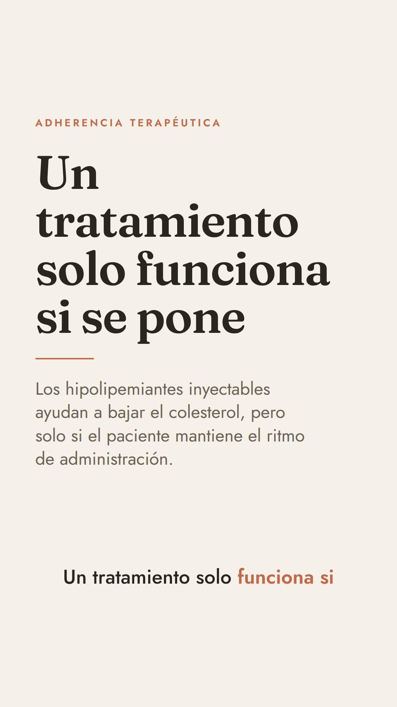
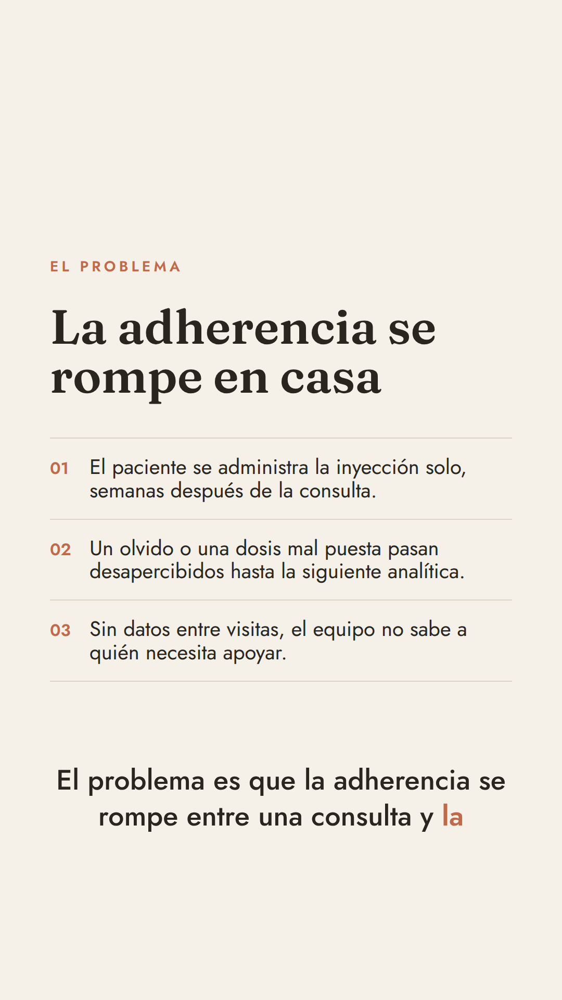
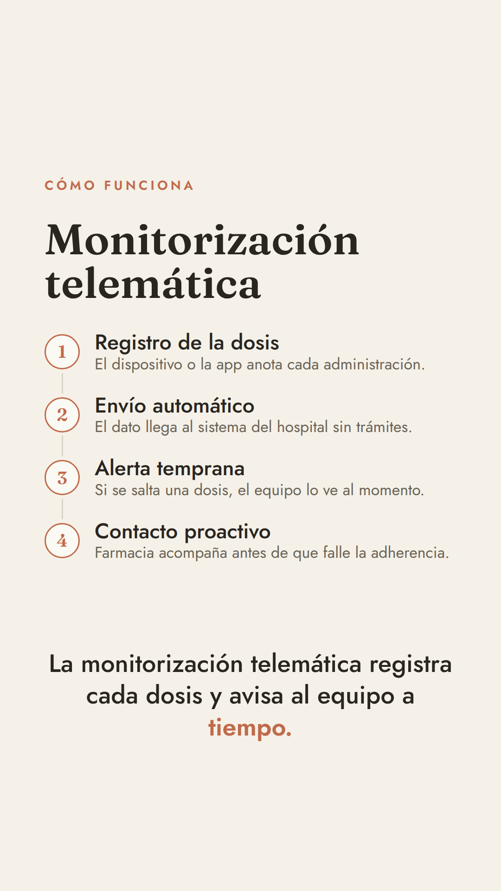
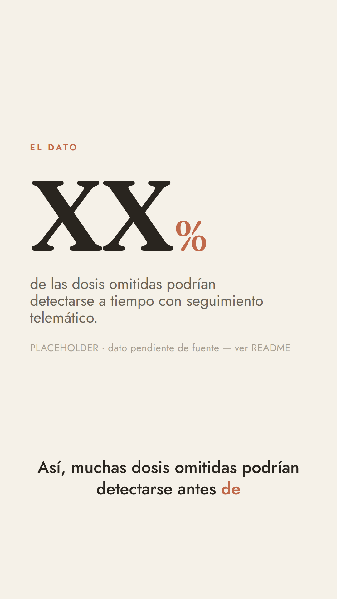
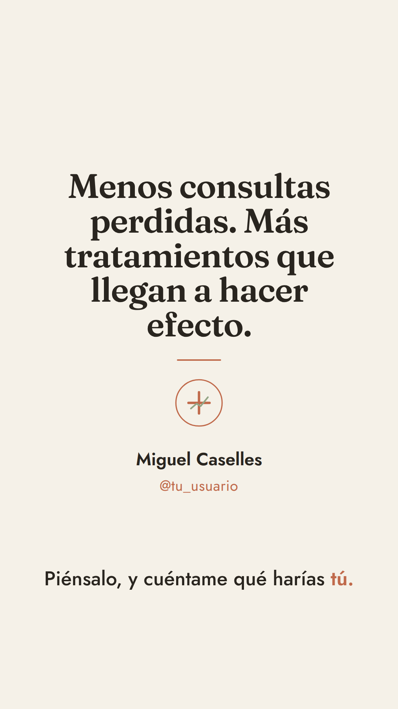
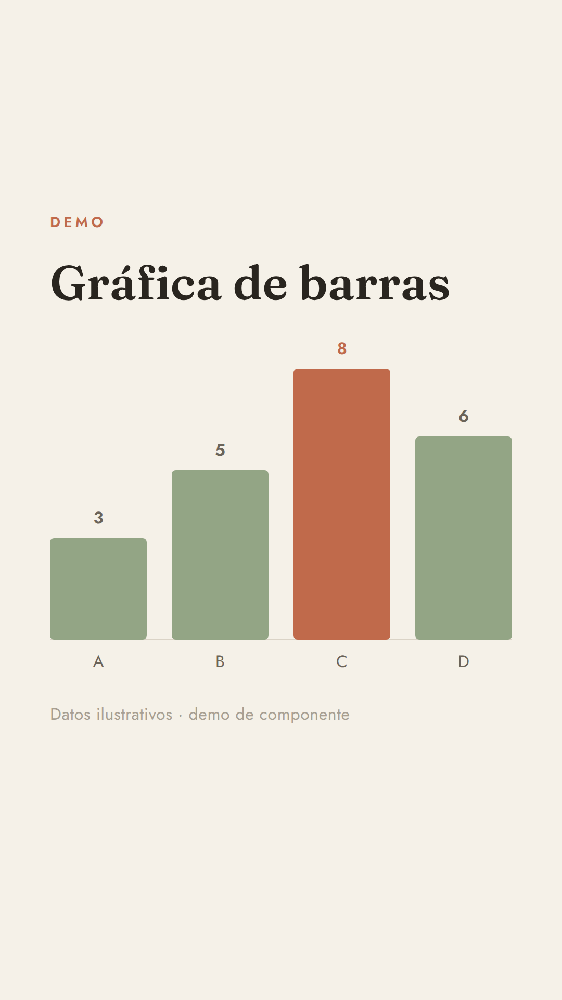
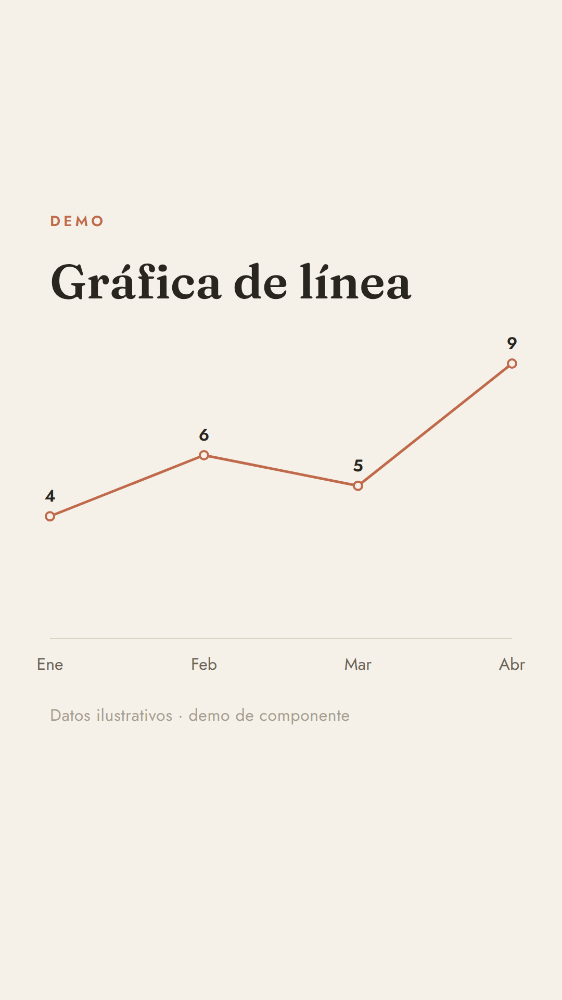

# Health Video System

Sistema **reutilizable** de vídeo de infografía animada (motion graphics) para
divulgación en salud, datos e IA. Construido con **Remotion + React +
TypeScript**. Estética **japandi** (minimalista escandinavo-japonés), siempre
idéntica.

> **La idea:** el diseño ya está resuelto. Para un vídeo nuevo **solo escribes
> un guion en JSON**. No vuelves a tocar componentes ni estilos.

- Formato **vertical 1080 × 1920**, **30 fps**, duración objetivo **45–60 s**.
- Salida **MP4 H.264** con un solo comando.
- **Un guion = un archivo** en `src/scripts/<nombre>.json`.

<p align="center">
  
  
  
  
  
</p>

Vídeo de ejemplo renderizado: [`renders/adherencia-hipolipemiantes.mp4`](renders/adherencia-hipolipemiantes.mp4).

---

## Índice

1. [Arranque rápido](#arranque-rápido)
2. [Cómo crear un vídeo nuevo (solo un JSON)](#cómo-crear-un-vídeo-nuevo-solo-un-json)
3. [Cómo cambiar los tokens (el diseño)](#cómo-cambiar-los-tokens-el-diseño)
4. [Cómo meter la locución (ElevenLabs)](#cómo-meter-la-locución-elevenlabs)
5. [Componentes disponibles](#componentes-disponibles)
6. [Zonas seguras](#zonas-seguras)
7. [Renderizar a MP4](#renderizar-a-mp4)
8. [🔴 Datos placeholder pendientes de rellenar por Miguel](#-datos-placeholder-pendientes-de-rellenar-por-miguel)
9. [Estructura del proyecto](#estructura-del-proyecto)
10. [Notas del entorno](#notas-del-entorno)

---

## Arranque rápido

```bash
npm install
npm run dev        # abre Remotion Studio para previsualizar y editar en vivo
```

En Studio verás dos composiciones:

- **`Video`** — el vídeo real, montado desde el guion JSON.
- **`Playground`** — auxiliar para previsualizar la gráfica `AnimatedChart`
  (datos ilustrativos). No forma parte del vídeo final.

---

## Cómo crear un vídeo nuevo (solo un JSON)

1. **Copia** `src/scripts/adherencia-hipolipemiantes.json` a un nombre nuevo,
   p. ej. `src/scripts/mi-tema.json`.
2. **Edita** el array `scenes`. Cada escena declara:
   - `component`: uno de los [componentes disponibles](#componentes-disponibles).
   - `durationInFrames`: cuánto dura (a 30 fps → 30 frames = 1 s;
     recomendado **120–240** = 4–8 s por escena).
   - `props`: las propiedades de ese componente (tipadas, ver
     [`src/types/schema.ts`](src/types/schema.ts)).
3. **Apunta el proyecto a tu guion**: en [`src/load.ts`](src/load.ts) cambia las
   dos importaciones (el `.json` y, si lo usas, el `.timings.json`).
4. `npm run dev` para previsualizar. `npm run render` para exportar.

La **duración total del vídeo es la suma de las escenas** y se calcula sola. Si
las cuentas no cuadran (frames no enteros, escena vacía…), el sistema **lanza un
error explícito** en Studio y en el render (ver `validateScript` en
`src/types/schema.ts`).

### Ejemplo mínimo de guion

```json
{
  "meta": {
    "title": "Mi vídeo",
    "audio": "silence.mp3",
    "timings": "mi-tema.timings.json"
  },
  "scenes": [
    {
      "component": "TitleCard",
      "durationInFrames": 180,
      "props": {
        "kicker": "Antetítulo",
        "title": "Mi titular grande",
        "subtitle": "Una frase de apoyo."
      }
    },
    {
      "component": "KeyStat",
      "durationInFrames": 180,
      "props": { "value": "XX", "suffix": "%", "label": "de lo que sea." }
    }
  ]
}
```

> **Regla de oro (innegociable): cero cifras inventadas.** Donde no tengas el
> dato real, usa un valor marcado como placeholder (`"XX"`, `"XX %"`) y anótalo
> en la [lista de datos pendientes](#-datos-placeholder-pendientes-de-rellenar-por-miguel).
> `KeyStat` acepta `value` como **texto** (se muestra tal cual, sin contar) o
> como **número** (cuenta hacia arriba). Usa texto para los placeholders.

---

## Cómo cambiar los tokens (el diseño)

Todo el diseño vive en **un único archivo**:
[`src/theme/tokens.ts`](src/theme/tokens.ts). Ningún componente hardcodea
colores, tamaños ni tiempos: todo sale de ahí. Cambia un token y cambia en todo
el vídeo.

### Paleta actual (japandi)

| Token | Hex | Uso |
|---|---|---|
| `color.bg` | `#F5F1E8` | fondo hueso/crema |
| `color.bgSunken` | `#EEE9DC` | paneles sutiles |
| `color.ink` | `#29251F` | tinta cálida (titulares y cuerpo) |
| `color.inkSoft` | `#6B6459` | texto secundario |
| `color.inkFaint` | `#A79F92` | pies, marcas de agua |
| `color.accent` | `#C06A4B` | **único** acento (terracota apagado) |
| `color.sage` | `#93A585` | secundario (verde salvia) |
| `color.line` | `#DAD3C6` | filetes finos / conectores |

### Tipografía

- Titulares: **Fraunces** (serif) · Cuerpo: **Jost** (sans geométrica).
- Se cargan con `@remotion/google-fonts` en
  [`src/theme/fonts.ts`](src/theme/fonts.ts). Para cambiar de fuente:
  1. Importa otra de `@remotion/google-fonts/<NombreFuente>` en `fonts.ts`.
  2. Actualiza `font.serif` / `font.sans` en `tokens.ts` (solo son etiquetas).
- Escala, pesos, interlineado y tracking: `type`, `weight`, `leading`,
  `tracking` en `tokens.ts`.

### Movimiento

`duration` (en frames), `easing` (curvas cubic-bézier), `spring` (configs sin
rebote) y `shift` (desplazamientos). Todo pensado para el ritmo calmado japandi:
fades y desplazamientos cortos, spring suave. **Prohibido** por diseño: flashes,
zooms bruscos, rebotes cómicos, glitch, partículas.

---

## Cómo meter la locución (ElevenLabs)

El proyecto viene con un **placeholder de silencio** en
`public/audio/silence.mp3` (45 s) para que todo funcione desde el minuto cero.

Para poner tu voz real:

1. **Genera la locución en ElevenLabs** (o donde prefieras) y **exporta un
   MP3**. Descárgalo, por ejemplo, como `narracion.mp3`.
2. **Cópialo a** `public/audio/narracion.mp3`.
3. **Apunta el guion a ese archivo**: en tu `src/scripts/<nombre>.json`, dentro
   de `meta`, pon `"audio": "narracion.mp3"`.
4. **Sincroniza los subtítulos** con la voz. Los subtítulos se pintan palabra a
   palabra desde un archivo de *timings* (`src/scripts/<nombre>.timings.json`)
   con tiempos en **segundos**:

   ```json
   {
     "lines": [
       {
         "words": [
           { "text": "Hola", "start": 0.0, "end": 0.35 },
           { "text": "mundo", "start": 0.35, "end": 0.8 }
         ]
       }
     ]
   }
   ```

   - Cada `line` es una frase corta (una “tarjeta” de subtítulo).
   - Dentro, cada palabra aparece cuando llega su `start`; la que se está
     diciendo ahora se resalta en el color de acento.
   - **Consejo:** ElevenLabs puede darte *timestamps* por carácter/palabra
     (API con `with_timestamps`). También sirve cualquier transcriptor que
     exporte tiempos por palabra (p. ej. Whisper). Vuelca esos tiempos a este
     formato. El script `scripts-tooling` no está incluido; de momento el
     archivo de timings del ejemplo se generó repartiendo las palabras de cada
     frase de forma uniforme.
5. **Ajusta las duraciones de las escenas** para que encajen con la voz (recuerda
   que la duración total del vídeo = suma de escenas).

> Si dejas `meta.audio` en `silence.mp3`, el vídeo se renderiza igual (mudo) y
> los subtítulos siguen apareciendo según sus timings. El componente de audio
> vive en [`src/components/Narration.tsx`](src/components/Narration.tsx).

---

## Componentes disponibles

Todos consumen `tokens.ts` y viven en `src/components/`. Sus props están tipadas
en [`src/types/schema.ts`](src/types/schema.ts).

| `component` | Para qué | Props principales |
|---|---|---|
| `TitleCard` | Gancho inicial: titular grande + subtítulo | `kicker?`, `title`, `subtitle?` |
| `KeyStat` | Una cifra enorme (cuenta hacia arriba) + etiqueta | `value` (nº o texto), `prefix?`, `suffix?`, `decimals?`, `from?`, `label`, `footnote?` |
| `BulletReveal` | 3–4 ideas escalonadas con filetes finos (sin viñetas) | `kicker?`, `title?`, `items[]` |
| `AnimatedChart` | Gráfica de barras o de línea que se dibuja sola | `variant` (`"bars"`\|`"line"`), `data[]`, `unit?`, `title?`, `footnote?` |
| `ProcessDiagram` | 3–5 pasos encadenados con conectores que se trazan | `kicker?`, `title?`, `steps[]` |
| `QuoteCard` | Frase destacada | `quote`, `attribution?` |
| `EndCard` | Cierre con mensaje, nombre, handle y logotipo | `name`, `handle`, `message?` |
| `Subtitles` | Subtítulos quemados palabra a palabra (capa global) | (se alimenta del `.timings.json`) |

> **`AnimatedChart` no aparece en el vídeo de ejemplo a propósito:** dibujar una
> gráfica exige datos numéricos reales, y la regla es no inventar cifras. En
> cuanto tengas datos con fuente, añade una escena `AnimatedChart` a tu guion.
> Puedes previsualizarla en la composición **`Playground`** de Studio.

Vista de las dos variantes de gráfica (datos ilustrativos):

<p align="center">
  
  
</p>

### El logotipo

`EndCard` usa [`src/components/Logo.tsx`](src/components/Logo.tsx), un **SVG
placeholder** (monograma de salud + línea de datos). Sustitúyelo por tu
logotipo real manteniendo el `viewBox="0 0 120 120"` y usando los tokens de
color.

---

## Zonas seguras

Reels, TikTok y Shorts superponen su interfaz encima del vídeo. El contenido
crítico (texto, cifras, subtítulos) se mantiene fuera de esas bandas:

- **220 px arriba** — avatar, botón de seguir, nombre del sonido.
- **340 px abajo** — caption, botones de interacción, barra de progreso.
- Además se reserva una **banda inferior para los subtítulos**
  (`safeArea.captionBand`) para que el contenido de escena nunca choque con
  ellos.

Se aplica con el componente [`SafeArea`](src/components/SafeArea.tsx) y los
valores están en `safeArea` dentro de `tokens.ts`. Para ver las guías mientras
ajustas, pon `showSafeGuides: true` en los `defaultProps` de la composición
`Video` (en [`src/Root.tsx`](src/Root.tsx)).

---

## Renderizar a MP4

```bash
npm run render
# equivale a:  npx remotion render Video out/video.mp4
```

Salida: `out/video.mp4` (H.264). La configuración de render está en
[`remotion.config.ts`](remotion.config.ts) (códec H.264, formato de imagen,
sobrescritura).

Otras opciones útiles:

```bash
# Un fotograma concreto (para revisar diseño):
npx remotion still Video out/frame.png --frame=90

# Renderizar un guion distinto (tras apuntar src/load.ts a él):
npx remotion render Video out/mi-tema.mp4
```

---

## 🔴 Datos placeholder pendientes de rellenar por Miguel

Estos valores están **marcados como placeholder** en el guion de ejemplo. **No
son datos reales**; sustitúyelos por cifras con fuente antes de publicar.

| Dónde | Placeholder actual | Qué falta |
|---|---|---|
| `KeyStat` (escena `4-dato-clave`) | **`XX %`** | % real de dosis omitidas detectables a tiempo con monitorización telemática, **con su fuente** (estudio/publicación). |
| `EndCard` (escena `6-cierre`) | **`@tu_usuario`** | Tu handle real de la red donde publiques (LinkedIn / Instagram / TikTok). |
| Locución | `public/audio/silence.mp3` (silencio) | Voz real (ElevenLabs) + timings de subtítulos sincronizados. |
| Logotipo | SVG placeholder en `Logo.tsx` | Tu logotipo real. |

> Cualquier otra cifra que quieras añadir (en un `AnimatedChart`, en más
> `KeyStat`, etc.) debe venir con fuente. Mientras no la tengas, usa `"XX"` y
> añádela a esta tabla.

---

## Estructura del proyecto

```
src/
├─ theme/
│  ├─ tokens.ts        ← ÚNICA fuente de verdad del diseño
│  └─ fonts.ts         ← carga de Fraunces + Jost (@remotion/google-fonts)
├─ types/
│  └─ schema.ts        ← tipos de escena + validación de duraciones + subtítulos
├─ components/
│  ├─ SafeArea.tsx     TitleCard.tsx   KeyStat.tsx     BulletReveal.tsx
│  ├─ AnimatedChart.tsx  ProcessDiagram.tsx  QuoteCard.tsx  EndCard.tsx
│  ├─ Subtitles.tsx    Narration.tsx   Logo.tsx
│  ├─ registry.tsx     ← mapa component→React
│  ├─ atoms.tsx        ← Kicker, Rule, Footnote
│  └─ anim.ts          ← utilidades de animación compartidas
├─ scripts/
│  ├─ adherencia-hipolipemiantes.json          ← el GUION del ejemplo
│  └─ adherencia-hipolipemiantes.timings.json  ← subtítulos del ejemplo
├─ Video.tsx           ← el motor: lee el guion y monta el vídeo
├─ Playground.tsx      ← previsualización de AnimatedChart
├─ Root.tsx            ← registra las composiciones
├─ load.ts             ← carga + valida el guion activo
└─ index.ts            ← entry point de Remotion
public/audio/silence.mp3   ← placeholder de locución
renders/                   ← vídeo de ejemplo entregado (.mp4)
preview/                   ← imágenes de previsualización para este README
```

---

## Notas del entorno

- **Fuentes tras un proxy con MITM de TLS:** `@remotion/google-fonts` descarga
  las fuentes desde `fonts.gstatic.com` al renderizar. Si tu entorno intercepta
  TLS con un CA propio, añade `--ignore-certificate-errors` al comando de
  render (no es necesario en una máquina normal con internet directo).
- **Navegador:** en local, Remotion gestiona su propio Chromium. Si necesitas
  apuntar a un binario ya instalado, exporta
  `REMOTION_BROWSER_EXECUTABLE=/ruta/al/chrome-headless-shell` (lo lee
  `remotion.config.ts`).
- El vídeo de ejemplo de este repo se renderizó con ambos flags:
  ```bash
  REMOTION_BROWSER_EXECUTABLE=<headless_shell> \
    npx remotion render Video renders/adherencia-hipolipemiantes.mp4 \
    --ignore-certificate-errors
  ```
